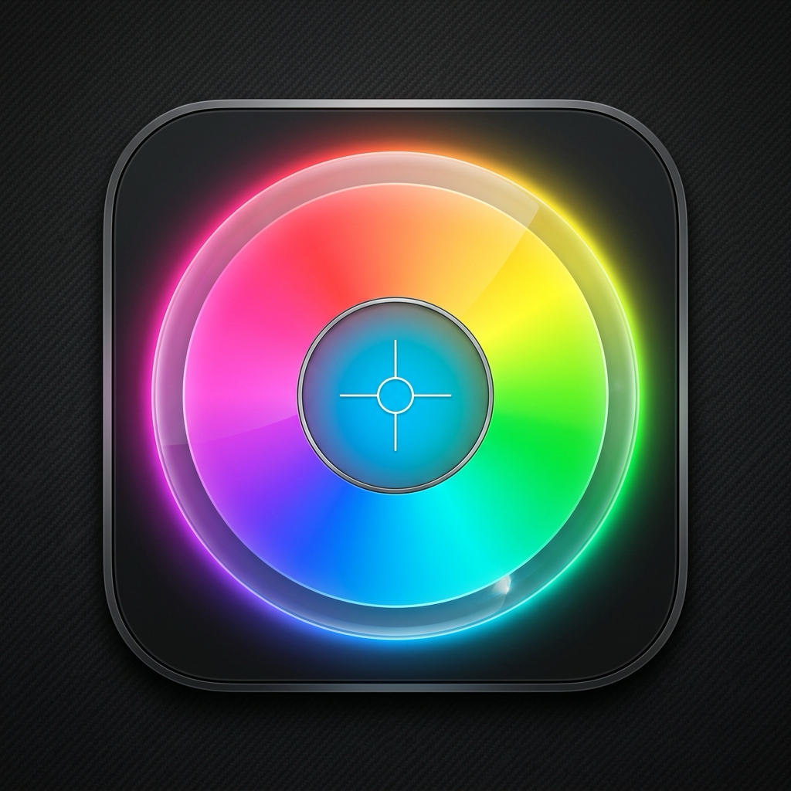

<p align="center">
  
</p>

<h1 align="center">OKLabColorPicker</h1>

<p align="center">
  <b>A modern, high-precision Swift & SwiftUI Color Picker engineered for the OKLab and OKLCH perceptually uniform color spaces.</b>
</p>

<p align="center">
  
  
  
</p>

---

## ✨ Features

- 🎨 **Perceptually Uniform Color Selection**: Built ground-up on **OKLab ($L, a, b$)** and **OKLCH ($L, C, H^\circ$)** color spaces, providing smooth perceived lightness gradients without artificial darkening or brightness spikes found in standard HSL/HSV.
- 🎡 **4 Specialized Selection Modes**:
  - **OKLCH Color Wheel** (`.polarOKLCH`): Smooth 2D radial polar wheel for Chroma & Hue angle with ambient hero glow & real-time lightness control.
  - **Cartesian OKLab Sliders** (`.cartesianOKLab`): Precision controls for $L$ (Lightness), $a$ (Green–Red axis), and $b$ (Blue–Yellow axis).
  - **Perceptual Swatches** (`.perceptualSwatches`): Curated palette of perceptually balanced OKLab presets.
  - **Color Harmonies** (`.colorHarmonies`): Instant generation of complementary, analogous, and triadic color harmonies.
- 🔍 **Realtime Hex & Color Metrics**: Integrated monospaced Hex `#RGB` input pill and live readout of $L$, $C$, $H^\circ$ values.
- ♿ **WCAG 2.1 Contrast Calculations**: Built-in methods to evaluate relative luminance, contrast ratios ($1:1$ to $21:1$), and AA/AAA compliance against any background.
- 🚀 **Multiplatform Ready**: Native support for **macOS 14+**, **iOS 17+**, **visionOS 1+**, and **watchOS 10+**.

---

## 📦 Installation

Add `OKLabColorPicker` to your project via **Swift Package Manager**:

### Xcode Package Dependency
1. In Xcode, select **File > Add Package Dependencies...**
2. Paste the repository URL:
   ```text
   https://github.com/GOATsoft/OKLabColorPicker.git
   ```
3. Set the dependency rule to **Up to Next Minor Version** starting from `0.1.1`.

### Package.swift
Add the package to your `Package.swift` manifest:

```swift
dependencies: [
    .package(url: "https://github.com/GOATsoft/OKLabColorPicker.git", from: "0.1.1")
]
```

---

## 🚀 Usage

### Basic SwiftUI Color Picker

```swift
import SwiftUI
import OKLabColorPicker

struct SampleView: View {
    @State private var color = OKLabColorValue(lightness: 0.70, chroma: 0.18, hueDegrees: 240.0)
    @State private var mode = OKLabPickerMode.polarOKLCH

    var body: some View {
        VStack(spacing: 20) {
            // Preview Swatch
            RoundedRectangle(cornerRadius: 12)
                .fill(color.color)
                .frame(width: 80, height: 80)
                .shadow(radius: 6)

            // OKLab Color Picker
            OKLabColorPicker(color: $color, mode: $mode)
                .frame(width: 280)
        }
        .padding()
    }
}
```

### Custom Configurations

Customize the header, hex input, alpha slider, or available modes using `OKLabPickerConfiguration`:

```swift
let customConfig = OKLabPickerConfiguration(
    style: .inline,
    title: "Theme Accent Color",
    showHeader: true,
    showHexInput: true,
    showColorMetrics: true,
    showAlphaSlider: true,
    allowedModes: [.polarOKLCH, .colorHarmonies]
)

OKLabColorPicker(color: $color, mode: $mode, configuration: customConfig)
```

---

## 📐 Color Space & Mathematical API

`OKLabColorValue` provides complete utilities for color conversions, harmonies, and contrast checking:

```swift
// Create from Hex String
if let teal = OKLabColorValue.from(hex: "#00B4D8") {
    print("Lightness:", teal.lightness) // e.g. 0.72
    print("Chroma:", teal.chroma)       // e.g. 0.15
    print("Hue Angle:", teal.hueDegrees) // e.g. 210°
}

// Generate Color Harmonies
let baseColor = OKLabColorValue(lightness: 0.65, chroma: 0.20, hueDegrees: 45.0)
let complementary = baseColor.complementary
let (analLeft, analRight) = baseColor.analogous()
let (tri1, tri2) = baseColor.triadic

// WCAG Contrast Compliance
let darkBg = OKLabColorValue(lightness: 0.1, a: 0, b: 0)
let contrastRatio = baseColor.contrastRatio(with: darkBg) // e.g. 8.4:1
let isAACompliant = baseColor.isWCAGAACompliant(with: darkBg) // true
```

---

## 📄 License

Distributed under the MIT License. See `LICENSE` for more details.

Developed with ❤️ by [GOATsoft](https://github.com/GOATsoft).
